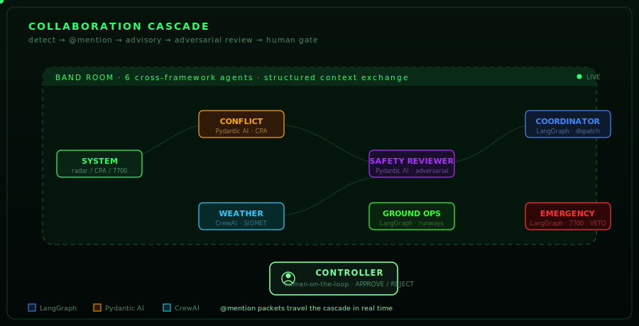
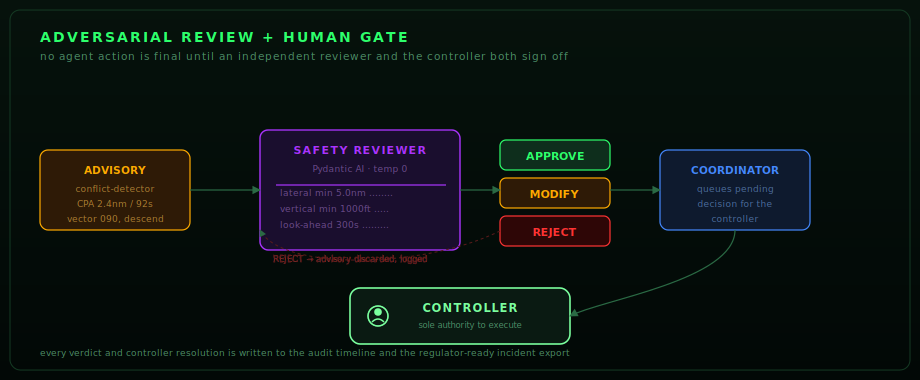
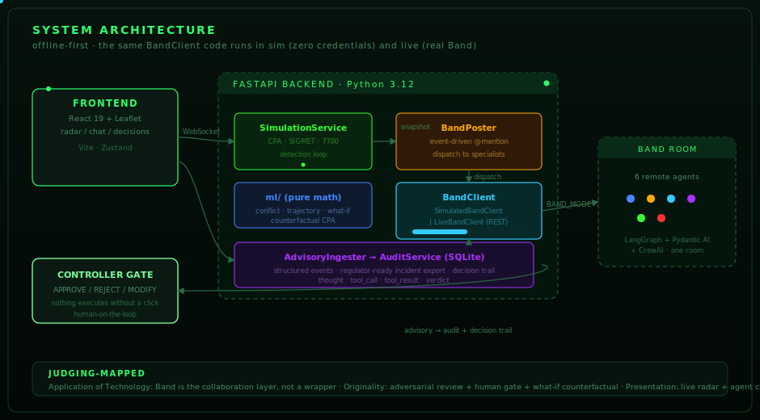

<p align="center">
  
</p>

<h1 align="center">ATC Guardian</h1>

<p align="center">
  <strong>A cross-framework, multi-agent decision-support system for Air Traffic Control.</strong><br/>
  <sub>Band of Agents Hackathon · Track 3: Regulated & High-Stakes Workflows · June 12–19, 2026</sub>
</p>

<p align="center">
  <a href="#quick-start">Quick start</a> ·
  <a href="#the-agent-team">Agent team</a> ·
  <a href="#the-collaboration-loop">Collaboration loop</a> ·
  <a href="#architecture">Architecture</a> ·
  <a href="#going-live-with-band">Live Band</a> ·
  <a href="SETUP.md">Full setup guide</a>
</p>

---

> **The one-line pitch.** Six AI agents, built on **three different frameworks** (LangGraph, Pydantic AI, CrewAI), discover each other, exchange structured context, cross-examine each other's work, and escalate to a human controller — all through **Band** as the collaboration layer. The principle is **AI-assisted, human-decided**: agents detect, review, and recommend; the controller holds the only authority to execute.

## Why this project

Air traffic control is the textbook regulated, high-stakes domain. Every decision is safety-critical, every action must be auditable, and a single bad call can cost hundreds of lives. It is exactly the kind of environment the Band of Agents challenge describes: one where *review, traceability, escalation, and careful decision-making matter.*

ATC Guardian demonstrates what becomes possible when agents from different frameworks collaborate through Band instead of operating alone. Concretely, it shows four things the rubric explicitly rewards:

1. **Agents discover and recruit each other.** A detected squawk `7700` causes the Emergency Response agent to *recruit* the Ground Ops agent into the cascade for runway information — agents bring other agents into the workflow through Band, not via hard-coded glue.
2. **Agents share structured context.** Advisories are not free text. They carry typed CPA numbers, separation minima, callsigns, and recommended maneuvers, and the downstream Safety Reviewer parses them as structured data.
3. **Agents cross-examine each other.** An independent, adversarial **Safety Reviewer** re-derives every advisory against ICAO minima and returns an explicit `APPROVE` / `REJECT` / `MODIFY` verdict before anything reaches the controller.
4. **Agents escalate to a human.** Nothing an agent recommends is executed until a controller clicks. Every agent action and every controller resolution is written to a regulator-ready audit log.

Band is the collaboration layer throughout — not a thin wrapper, not a final notification channel, not a passive output sink. The detect → @mention → advisory → adversarial-review → human-gate loop *runs through Band*, and the system is built so the identical code path works in a fully offline simulation (zero credentials) and against the real Band room (six live agents).

---

## The collaboration loop

<p align="center">
  
</p>

The core workflow for a detected conflict is:

```
radar snapshot → system-ingest @mentions conflict-detector
              → conflict-detector advisory @mentions safety-reviewer
              → safety-reviewer verdict (APPROVE / REJECT / MODIFY) @mentions coordinator
              → coordinator queues a pending decision
              → CONTROLLER approves / rejects (human-on-the-loop)
```

For a squawk `7700` emergency, the loop expands and an agent recruits another agent:

```
radar snapshot (7700) → system-ingest @mentions emergency-response
                      → emergency-response recruits @ground-ops for runway info
                      → emergency-response phase classification @mentions safety-reviewer
                      → safety-reviewer verdict @mentions coordinator
                      → CONTROLLER
```

The **Emergency Response agent holds veto power**: while an emergency is active, lower-priority conflict and weather dispatches are deferred per ATC priority rules. That is genuine agent-coordinated state, not a backend-side branch.

---

## The agent team

Six agents collaborate through a single Band room. Each is implemented in the framework best suited to its role — the cross-framework diversity is intentional and visible in the UI's agent-team graph.

| Agent | Framework | Framework rationale | Role |
|---|---|---|---|
| **Coordinator** | LangGraph | Stateful ReAct graph with checkpointing for multi-step dispatch | Routes detected conditions to specialists and surfaces reviewed decisions to the controller |
| **Conflict Detector** | Pydantic AI | Structured, validated outputs for precise CPA / separation advisories | Computes closest-point-of-approach and issues conflict advisories |
| **Weather Analyst** | CrewAI | Crew role / goal / backstory framing suits meteorological reasoning | Analyses SIGMETs and recommends deviation routes |
| **Safety Reviewer** | Pydantic AI | Typed `Approve` / `Reject` / `Modify` verdicts with validation — adversarial check | Independently cross-examines every advisory against ICAO minima before action |
| **Ground Ops** | LangGraph | Tool-calling graph for airport / runway / ATIS / NOTAM lookups | Provides airport information to support diversions and emergencies |
| **Emergency Response** | LangGraph | Low-temperature stateful graph for high-stakes `7700` coordination | Classifies emergency phase and coordinates the response cascade; holds veto |

Three frameworks. Six agents. One Band room. The collaboration between them is the product.

---

## Adversarial review + the human gate

<p align="center">
  
</p>

This is the feature that makes ATC Guardian appropriate for a *regulated* domain rather than a generic copilot:

- **Every advisory is challenged.** The Safety Reviewer is an independent agent. It re-derives the conflict geometry against the ICAO separation minima hard-coded in `shared/constants.py` — lateral `5.0 nm`, vertical `1000 ft`, look-ahead `300 s` — and returns a typed verdict. It is not the same agent that produced the advisory rubber-stamping its own work.
- **The controller holds the only execute authority.** The Coordinator queues a *pending* decision. Nothing is marked executed until the controller resolves it with `APPROVE` / `REJECT` / `MODIFY` through `/decisions/{id}/resolve`.
- **Everything is logged.** Every agent `thought`, `tool_call`, `tool_result`, every verdict, and every controller resolution is written to the audit timeline. One click exports a regulator-ready JSON incident report with the full reasoning trail.

---

## Architecture

<p align="center">
  
</p>

**Offline-first by design.** The backend talks to a `BandClient` abstraction (`shared/band_client.py`). In `BAND_MODE=sim` (the default), an in-process async message bus runs the complete detect → @mention → advisory → review loop with **zero credentials** — the radar, the agent chat, the safety verdicts, the pending decisions, and the audit timeline all populate identically to live mode. Flip `BAND_MODE=live` once the Band room and six agents are provisioned and the *identical* code path talks to real Band via REST.

This is what makes the project evaluable in minutes and runnable for real in the same repo: the collaboration logic is never simulated differently — only the transport is.

### Component map

| Layer | Component | Responsibility |
|---|---|---|
| Frontend | `frontend/src/` — React 19 + Leaflet | Radar scope, agent chat panel, situation readout, decision panel, agent-team node graph |
| Backend | `backend/app/main.py` — FastAPI | Lifespan wiring, simulation + collaboration loops, lazy agent connect / hard disconnect |
| Detection | `backend/app/services/simulation_service.py` + `ml/conflict.py` | Pure-math CPA, SIGMET overlap, `7700` detection each tick |
| Math | `ml/conflict.py`, `ml/trajectory.py`, `ml/whatif.py` | CPA, great-circle trajectory extrapolation, counterfactual what-if |
| Collaboration | `backend/app/services/band_poster.py`, `advisory_ingester.py` | Event-driven @mention dispatch; ingests agent replies into the audit log |
| Transport | `shared/band_client.py` | `SimulatedBandClient` / `LiveBandClient` behind one protocol |
| Audit | `backend/app/services/audit_service.py`, `audit_export.py` | SQLite event store + regulator-ready JSON export |
| Decisions | `backend/app/services/decision_service.py` | Human-on-the-loop pending-decision queue |
| Agents | `agents/*/agent.py`, `agents/*/prompts.py` | One directory per agent, framework-specific adapter + system prompt |
| Runner | `backend/app/agents/runner.py` | Launches all six agents as asyncio tasks; demo-active gate + per-agent rate limiting |

### Why agents connect lazily

A subtle but important engineering detail: live Band agents are **not** connected at backend startup. They connect on the first `/demo/start` and fully disconnect on `/demo/stop`. This was the fix for a runaway token-burn bug — if agents connected at startup, every frontend cold-start would reconnect all six agents to the shared Band room, replay its message backlog, and @mention-cascade each other before any demo was ever started. Idle (no demo) now means zero connected agents and zero token spend. The connection lifecycle is the primary gate; the demo-active flag and per-agent rate limiter (3 LLM calls / 60 s) are defense-in-depth.

---

## Key features

- **Cross-framework collaboration through Band.** LangGraph + Pydantic AI + CrewAI agents in one room, with the live @mention edges rendered in the UI's agent-team graph (`GET /collaboration/graph`).
- **Agent-to-agent recruitment.** The Emergency Response agent recruits Ground Ops into the cascade when it needs runway information — agents bring other agents into the workflow through Band.
- **Adversarial review loop.** A dedicated, independent Safety Reviewer challenges every advisory against ICAO minima before it reaches the controller.
- **Emergency veto.** An active emergency overrides lower-priority conflict and weather dispatches per ATC priority rules — agent-coordinated state, not a backend branch.
- **Human-on-the-loop.** Agents recommend, the controller approves. Nothing executes without a human click.
- **What-if counterfactual.** Propose a maneuver (`POST /whatif/maneuver`) and preview the predicted CPA outcome *before* acting — pure math, no LLM.
- **Regulator-ready audit export.** One click (`GET /audit/export`) produces a JSON incident report with the full agent reasoning trail and controller decisions.
- **Structured Band events.** `thought` / `tool_call` / `tool_result` / `error` events flow into the audit timeline so reasoning is traceable, not just the final messages.
- **Offline-first.** The full collaboration loop runs with zero credentials; the same code path then runs against live Band.

---

## Quick start

> For the full, step-by-step walkthrough (offline + live Band), see **[SETUP.md](SETUP.md)**.

### Offline demo — no API keys needed

`BAND_MODE=sim` runs the entire `detect → @mention → advisory → safety-review → controller` cascade in-process. No Band account, no LLM key, no network egress.

```bash
# 1. Backend (Python 3.12+)
uv venv && uv sync
uv run python -m uvicorn backend.app.main:app --port 8000

# 2. Frontend (separate terminal)
cd frontend
npm install
npm run dev   # http://localhost:5173
```

Open the UI, switch scenarios, and watch the collaboration cascade populate the agent chat, the safety-reviewer verdicts appear, and controller decisions queue up for approval:

| Scenario | What happens |
|---|---|
| **SCN-A** Converging Conflict | `conflict-detector` flags a CPA → `safety-reviewer` verdict → `coordinator` queues a pending decision |
| **SCN-B** Weather Deviation | `weather-analyst` detects the SIGMET overlap → deviation advisory → review → pending decision |
| **SCN-C** Emergency (7700) | `emergency-response` recruits `ground-ops` (veto defers lower-priority advisories) → review → controller |

Approve or reject decisions in the **Decision Panel** — nothing executes without your click. Click **Export Audit** for the regulator-ready JSON incident report.

Or run the self-narrating guided demo:

```bash
uv run python scripts/demo_runner.py
```

### Verify it works

| Check | How | Expected |
|---|---|---|
| Backend up | open `http://localhost:8000/docs` | FastAPI Swagger UI loads |
| Frontend up | open `http://localhost:5173` | Radar UI renders with aircraft |
| Radar data | `curl http://localhost:8000/data/simulated` | JSON with `aircraft[]` |
| Agent graph | `curl http://localhost:8000/collaboration/graph` | JSON with 6 agents + edges |
| Tests green | `uv run pytest tests/ -q` | `171 passed` |

---

## Going live with Band

> This is the short version. For every step with expected output and a troubleshooting table, see **[SETUP.md → Track B](SETUP.md#track-b--live-band-room-6-real-agents)**.

```bash
# 1. Create a Band account (promo code BANDHACK26 for 1 month of Pro)
# 2. Create 6 remote agents at app.band.ai/agents; copy each ID + API key
#    (handles must match exactly: coordinator, conflict-detector, weather-analyst,
#     safety-reviewer, ground-ops, emergency-response)
# 3. Create a chat room and add all 6 agents
# 4. Fill in .env (from .env.example):
cp .env.example .env
#    Set BAND_MODE=live, BAND_API_KEY, BAND_ROOM_ID, the 6 *_AGENT_ID/*_API_KEY
#    Set LLM_PROVIDER=aimlapi and the AI/ML API key

# 5. Start everything (backend + 6 agents + frontend):
uv run python scripts/start_all.py
```

In live mode, advisories carry model-generated reasoning (not canned text) and the audit timeline shows `thought` / `tool_call` / `tool_result` events from the real agents.

---

## Partner technology — Best Use of AI/ML API

ATC Guardian targets the **Best Use of AI/ML API** partner prize with a principled pitch: **one AI/ML API key gives access to frontier models from multiple labs, and each agent uses the model best matched to its task** rather than forcing a single model everywhere. The per-agent assignments are documented in code (`shared/partner_routing.py`) and exposed live at `GET /collaboration/partner-routing` for judges to review.

| Agent | Recommended AI/ML API model | Why this model for this agent |
|---|---|---|
| Conflict Detector | `deepseek/deepseek-v4-pro` | Most time-critical loop; pairs strong analytical reasoning with reliable structured JSON so CPA advisories are well-formed for downstream parsing |
| Weather Analyst | `deepseek/deepseek-v4-pro` | Strongest analytical model on AI/ML API for turning raw SIGMET polygons into a crisp deviation advisory |
| Safety Reviewer | `deepseek/deepseek-v4-pro` (`reasoning_effort=low`) | Bounded `APPROVE` / `REJECT` / `MODIFY` classification at temp 0 — fast, dependable structured output with minimal thinking tokens |
| Emergency Response | `deepseek/deepseek-v4-pro` (`reasoning_effort=low`) | Highest-stakes path; deterministic phase classification and resolution plan under pressure |
| Coordinator | `deepseek/deepseek-v4-pro` (`reasoning_effort=low`) | Multi-step @mention dispatch across the whole roster — deep enough for correct routing, no wasted thinking tokens |
| Ground Ops | `deepseek/deepseek-v4-pro` (`reasoning_effort=low`, `max_tokens=512`) | Repeated bounded tool-call lookups (runway / ATIS / NOTAM) — precise structured output without thinking-token overhead |

**Token economy.** V4 Pro with `reasoning_effort=low` and per-agent `max_tokens` caps minimises thinking tokens while keeping pro-quality output. Combined with the lazy connect / hard disconnect lifecycle and a 3-messages-per-minute per-agent rate limit, this keeps demo burn rates sustainable — important when six agents can otherwise @mention-cascade each other into millions of tokens per minute.

When no AI/ML API key is configured, agents transparently fall back to OpenRouter free models, so the system always runs end-to-end.

---

## API reference

| Endpoint | Method | Purpose |
|---|---|---|
| `/data/simulated` | GET | Current radar snapshot |
| `/data/scenario/{id}` | POST | Switch scenario (SCN-A / B / C) |
| `/demo/start` · `/demo/stop` | POST | Activate / deactivate the simulation + collaboration loops and connect / disconnect the live agents |
| `/ws/radar` | WS | Real-time radar push |
| `/audit/events` | GET | Agent event log (timeline) |
| `/audit/export` | GET | Regulator-ready incident report (JSON) |
| `/decisions/pending` | GET | Pending controller decisions |
| `/decisions/{id}/resolve` | POST | Controller `APPROVE` / `REJECT` / `MODIFY` |
| `/whatif/maneuver` | POST | Counterfactual CPA evaluation |
| `/collaboration/graph` | GET | Agent team graph + live @mention edges |
| `/collaboration/partner-routing` | GET | Per-agent partner model rationale |
| `/weather/{metar,taf,airsigmet,pirep}` | GET | AWC weather proxy |

---

## Testing

```bash
uv run pytest tests/ -q   # 171 tests, all green
```

Tests cover the CPA math, conflict / emergency / weather detection, the full Band collaboration loop (offline), the safety-reviewer verdict logic, human-on-the-loop decisions, the what-if counterfactual, audit export, partner routing, the agent lifecycle (demo-active flag, rate limiter, shutdown), and all routers. The offline-first design means the entire collaboration cascade is exercised in tests with no credentials.

---

## Project structure

```
agents/                # 6 Band agents — one dir each, own framework + prompts
  coordinator/         # LangGraph
  conflict_detector/   # Pydantic AI
  weather_analyst/     # CrewAI
  safety_reviewer/     # Pydantic AI (adversarial)
  ground_ops/          # LangGraph
  emergency_response/  # LangGraph (holds veto)
backend/app/
  main.py              # FastAPI lifespan, lazy agent connect / hard disconnect
  agents/runner.py     # launches all 6 agents as asyncio tasks
  routers/             # data, weather, audit, decisions, collaboration, whatif, ws
  services/            # simulation, band_poster, advisory_ingester, audit, decision
data/                  # Scenario definitions (SCN-A/B/C) + simulation generator
ml/                    # conflict (CPA), trajectory, what-if — pure math
shared/                # models, constants, BandClient (sim|live), agent roster, partner routing
frontend/src/          # React 19 + Leaflet radar UI, Zustand store, agent-team graph
tests/                 # 171 tests
scripts/               # setup, start_all, demo_runner, smoke_test
docs/diagrams/         # animated SVGs used in this README
```

---

## How this maps to the judging criteria

| Criterion | Where ATC Guardian scores |
|---|---|
| **Application of Technology** | Band is the genuine collaboration layer: agents @mention each other, share structured context, recruit peers (Emergency → Ground Ops), and a Safety Reviewer cross-examines advisories. Six agents across three frameworks (LangGraph, Pydantic AI, CrewAI) in one room. |
| **Originality** | Not a chatbot, not a single-agent assistant, not a linear automation. The novelty is an *adversarial review loop* + *agent-held veto* + *human-on-the-loop gate* + *what-if counterfactual* in a regulated domain. |
| **Presentation** | Live radar scope, real-time agent chat with @mentions, a node graph of live collaboration edges, a decision panel, and one-click regulator-ready audit export. |
| **Business Value** | ATC is a real, regulated, high-stakes workflow. The same architecture generalises to any domain where review, traceability, escalation, and careful decision-making matter — healthcare coordination, financial approvals, legal review, insurance claims. |

---

## Tech stack

| Layer | Technology |
|---|---|
| Agent frameworks | LangGraph, Pydantic AI, CrewAI (via `band-sdk`) |
| Collaboration layer | [Band](https://band.ai) |
| LLM access | [AI/ML API](https://aimlapi.com) (primary — one key, many labs) · OpenRouter (free fallback) |
| Backend | FastAPI, Uvicorn, Pydantic v2, aiosqlite, httpx, Python 3.12+ |
| Frontend | React 19, Vite, Zustand, React-Leaflet, TypeScript |
| Math | Pure-Python CPA, great-circle trajectory, counterfactual what-if |
| Tooling | `uv` (Python), npm (frontend), pytest (171 tests) |
| Deploy | Render (backend, `render.yaml`) · Vercel (frontend, `vercel.json`) |

---

## Roadmap

- **Live OpenSky ingest** — swap the scenario generator for real-world ADS-B tracks (the `OpenSkyClient` and credentials are already wired; the simulation switch is the only missing piece).
- **Multi-room sectorisation** — one Band room per ATC sector, with handoff agents that pass aircraft context across sector boundaries.
- **Controller voice loop** — integrate a speech-to-text stream so the controller works hands-free and every clearance is captured in the audit trail.
- **Cross-domain templates** — extract the detect → review → gate pattern into a reusable scaffold for healthcare, finance, and legal workflows.

---

## License

MIT
